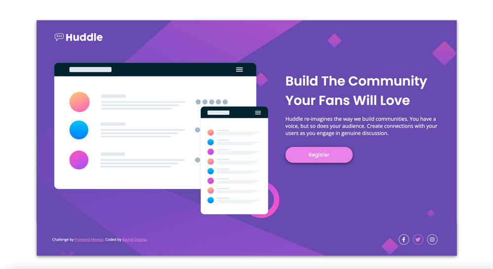
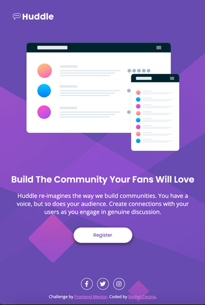

# Frontend Mentor - Huddle landing page with single introductory section solution

This is a solution to the [Huddle landing page with single introductory section challenge on Frontend Mentor](https://www.frontendmentor.io/challenges/huddle-landing-page-with-a-single-introductory-section-B_2Wvxgi0). Frontend Mentor challenges help you improve your coding skills by building realistic projects. 

## Table of contents

- [Overview](#overview)
  - [The challenge](#the-challenge)
  - [Screenshot](#screenshot)
  - [Links](#links)
- [My process](#my-process)
  - [Built with](#built-with)
  - [What I learned](#what-i-learned)
  - [Continued development](#continued-development)
  - [Useful resources](#useful-resources)
- [Author](#author)

**Note: Delete this note and update the table of contents based on what sections you keep.**

## Overview

### The challenge

Users should be able to:

- View the optimal layout for the page depending on their device's screen size
- See hover states for all interactive elements on the page

### Screenshot

#### Desktop Layout

#### Desktop Layout with Hover States

#### Tablet Layout

#### Mobile Layout

### Links

- Solution URL: [GitHub Repo](https://github.com/cessnar516/FM-Huddle-Landing-Page)
- Live Site URL: [GitHub Pages](https://cessnar516.github.io/FM-Huddle-Landing-Page/)

## My process

### Built with

- Semantic HTML5 markup
- SASS
- Flexbox
- Mobile-first workflow
- Font Awesome icons

### What I learned

For this challenge, I continued to develop my understanding of Flexbox - specifically, the relationship between the flex container and flex items. Flexbox is used to center align the items in the `<main>` element on small screens, and a media query is used to change the `flex-direction` to row in order to display the product image and text in two columns on larger screens. The `
` is also a flex container ad is used to align the heading, paragrah, and register link centered on smaller screens and left aligned on larger screens. The footer is also a flex container to center align the social links and attribution text on small screens and align them on either side of lager screens with `justify-content: space-between`. Flexbox is also used to align the social links with space between them, and to center the social icons inside of the round outlines. 

I also continued to practice using semantic HTML elements to define the sections of the page and the types of content presented. The Huddle logo at the top of the page is inside of a `<header>` element, a `<main>` element contains the product image, heading, text, and register link, and a `<footer>` element contains the attribution paragraph and social links. I also chose to mark up the social links using a `<ul>` because they are a list of similar items. Using a list will give screen readers added context to understand the content. I also used a `<section>` element to contain the heading, text, and register button to make that area more accessible.

While testing the final layout, I realized the register link and the social links were not focusable for keyboard navigation. To fix this issue, I added `tabindex="0"` to those links. I also added a focus states to all the links on the page to help keyboard users easily see where they are on the page.

### Continued development

One thing I had trouble with was importing Font Awesome into my project. I use Font Awesome regularly at work, but it's already built into our system. The easiest way I found was to create a kit and copy the generated script tag into the head of my HTML document. I will continue to explore ways to integrate Font Awesome in future projects.

### Useful resources

- [Font Awesome](https://fontawesome.com/start) - This page helped me figure out how to add Font Awesome to my project for the social icons. 
- [HTML Validator](https://validator.w3.org/) - It's always a good idea to validate your HTML to check for errors, and this is a great tool you can use with a live site, uploaded file, or you can also paste your code in.
- [CSS Validator](https://jigsaw.w3.org/css-validator/) - Running your CSS through this vailidator is a great way to check for errors before you upload your solution. 

## Author

- LinkedIn - [Rachel Cessna](https://www.linkedin.com/in/rachelacessna/)
- Frontend Mentor - [@cessnar516](https://www.frontendmentor.io/profile/cessnar516)
- CodePen - [@cessnar](https://codepen.io/cessnar)
